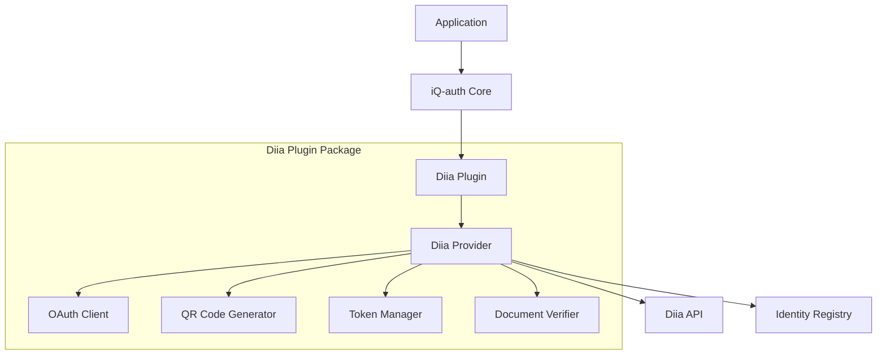
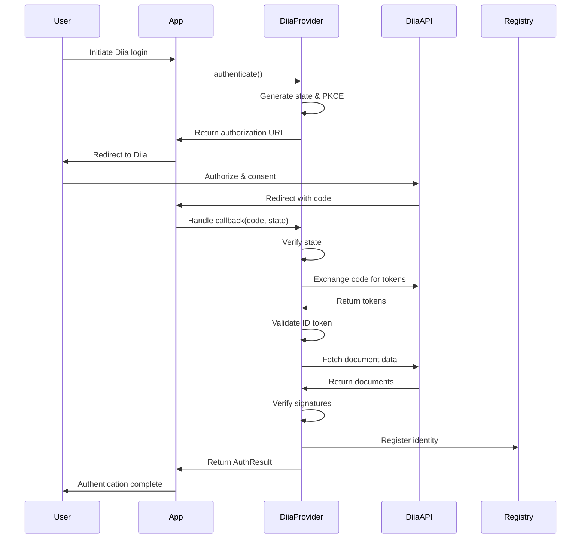

# Design Document: Diia.gov.ua Authentication Plugin

## Overview

The Diia.gov.ua authentication plugin enables iQ-auth applications to authenticate users through Ukraine's government digital identity platform. The plugin implements OAuth 2.0 authorization code flow with PKCE, QR code authentication, document verification, and secure token management.

The plugin consists of two main components:
- **DiiaPlugin**: Implements the iQ-auth plugin interface and manages lifecycle
- **DiiaProvider**: Implements the authentication provider interface and handles OAuth flows

## Architecture

### Component Diagram



### Authentication Flow



## Components and Interfaces

### DiiaPlugin

Implements the `IAuthPlugin` interface from iQ-auth core.

```typescript
interface DiiaPluginConfig {
  clientId: string;
  clientSecret: string;
  redirectUri: string;
  environment?: 'production' | 'sandbox';
  scopes?: string[];
  timeout?: number;
}

class DiiaPlugin implements IAuthPlugin {
  readonly name = 'diia';
  readonly version = '0.1.0';
  readonly type = 'government';
  readonly provider: DiiaProvider;
  
  constructor(config: DiiaPluginConfig);
  async initialize(config: DiiaPluginConfig): Promise<void>;
  async destroy(): Promise<void>;
}
```

### DiiaProvider

Implements the `IAuthProvider` interface from iQ-auth core.

```typescript
interface DiiaAuthOptions {
  scopes?: string[];
  qrCode?: boolean;
  locale?: 'uk' | 'en';
}

interface DiiaAuthResult extends AuthResult {
  metadata?: {
    documents?: DiiaDocument[];
    diiaUserId?: string;
    verificationLevel?: 'basic' | 'full';
  };
}

class DiiaProvider implements IAuthProvider {
  readonly name = 'diia';
  readonly type = 'government';
  
  async authenticate(options: DiiaAuthOptions): Promise<DiiaAuthResult>;
  async verify(token: string): Promise<VerifyResult>;
  async refresh(refreshToken: string): Promise<DiiaAuthResult>;
  
  // Diia-specific methods
  generateAuthorizationUrl(options: DiiaAuthOptions): AuthorizationRequest;
  generateQRCode(deepLink: string): Promise<Buffer>;
  handleCallback(code: string, state: string): Promise<DiiaAuthResult>;
  verifyDocument(document: DiiaDocument): Promise<boolean>;
}
```

### OAuth Client

Handles OAuth 2.0 protocol implementation.

```typescript
interface AuthorizationRequest {
  url: string;
  state: string;
  codeVerifier: string;
  expiresAt: Date;
}

interface TokenResponse {
  accessToken: string;
  refreshToken: string;
  idToken: string;
  expiresIn: number;
  tokenType: string;
}

class OAuthClient {
  constructor(config: DiiaPluginConfig);
  
  generateAuthorizationUrl(scopes: string[], state: string, codeChallenge: string): string;
  exchangeCodeForTokens(code: string, codeVerifier: string): Promise<TokenResponse>;
  refreshAccessToken(refreshToken: string): Promise<TokenResponse>;
  validateIdToken(idToken: string): Promise<IdTokenClaims>;
}
```

### Document Verifier

Validates cryptographic signatures on government documents.

```typescript
interface DiiaDocument {
  type: 'passport' | 'id_card' | 'driver_license';
  number: string;
  issuedAt: Date;
  expiresAt: Date;
  data: Record<string, unknown>;
  signature: string;
}

class DocumentVerifier {
  constructor(publicKey: string);
  
  async verifySignature(document: DiiaDocument): Promise<boolean>;
  isExpired(document: DiiaDocument): boolean;
  extractClaims(document: DiiaDocument): DocumentClaims;
}
```

### Token Manager

Manages token storage and lifecycle.

```typescript
interface StoredSession {
  userId: string;
  accessToken: string;
  refreshToken: string;
  idToken: string;
  expiresAt: Date;
  createdAt: Date;
}

class TokenManager {
  constructor(storage: IStorageAdapter);
  
  async storeSession(userId: string, tokens: TokenResponse): Promise<string>;
  async getSession(sessionToken: string): Promise<StoredSession | null>;
  async refreshSession(sessionToken: string): Promise<StoredSession>;
  async invalidateSession(sessionToken: string): Promise<void>;
  isExpired(session: StoredSession): boolean;
}
```

### QR Code Generator

Generates QR codes for mobile authentication.

```typescript
class QRCodeGenerator {
  async generate(deepLink: string, options?: QROptions): Promise<Buffer>;
  async generateDataURL(deepLink: string, options?: QROptions): Promise<string>;
}

interface QROptions {
  size?: number;
  errorCorrectionLevel?: 'L' | 'M' | 'Q' | 'H';
  margin?: number;
}
```

## Data Models

### Identity Data Structure

When a user authenticates with Diia, the following identity is registered:

```typescript
{
  type: 'government',
  userId: 'user-123',
  provider: 'diia',
  data: {
    diiaUserId: 'diia-user-456',
    email: 'user@example.com',
    phone: '+380501234567',
    firstName: 'Іван',
    lastName: 'Петренко',
    middleName: 'Олександрович',
    documents: [
      {
        type: 'passport',
        number: 'AA123456',
        issuedAt: '2020-01-15T00:00:00Z',
        expiresAt: '2030-01-15T00:00:00Z',
        verified: true
      }
    ],
    verificationLevel: 'full'
  },
  verified: true,
  createdAt: '2025-01-15T10:30:00Z',
  updatedAt: '2025-01-15T10:30:00Z'
}
```

### Configuration Schema

```typescript
const configSchema = {
  clientId: { type: 'string', required: true, minLength: 1 },
  clientSecret: { type: 'string', required: true, minLength: 1 },
  redirectUri: { type: 'string', required: true, pattern: /^https?:\/\/.+/ },
  environment: { type: 'string', enum: ['production', 'sandbox'], default: 'production' },
  scopes: { type: 'array', items: { type: 'string' }, default: ['openid', 'profile'] },
  timeout: { type: 'number', min: 1000, max: 300000, default: 60000 }
};
```

## Correctness Properties

*A property is a characteristic or behavior that should hold true across all valid executions of a system-essentially, a formal statement about what the system should do. Properties serve as the bridge between human-readable specifications and machine-verifiable correctness guarantees.*

### Property 1: Authorization URL contains required OAuth parameters

*For any* valid configuration and authentication options, the generated authorization URL should contain all required OAuth 2.0 parameters: client_id, redirect_uri, scope, state, response_type, and code_challenge.

**Validates: Requirements 1.1**

### Property 2: State parameter uniqueness

*For any* sequence of authorization requests, each generated state parameter should be unique and cryptographically random.

**Validates: Requirements 6.1**

### Property 3: State verification prevents CSRF

*For any* authorization callback with a state parameter that does not match a pending request, the provider should reject the authentication.

**Validates: Requirements 6.2, 6.3**

### Property 4: Token exchange produces valid tokens

*For any* valid authorization code and code verifier, the token exchange should return access token, refresh token, and ID token with valid expiration times.

**Validates: Requirements 1.2**

### Property 5: ID token parsing extracts identity

*For any* valid ID token JWT, the provider should successfully extract user identity claims (sub, email, name).

**Validates: Requirements 1.3**

### Property 6: Successful authentication registers identity

*For any* successful authentication flow, the Identity Registry should contain a new government identity with verified=true and correct user data.

**Validates: Requirements 1.4**

### Property 7: Authentication failures return error results

*For any* authentication failure scenario (network error, invalid code, denied authorization), the provider should return an AuthResult with success=false and an appropriate error message.

**Validates: Requirements 1.5, 7.1, 7.2, 7.3, 7.4, 7.5**

### Property 8: QR code round-trip preserves URL

*For any* deep link URL, encoding it as a QR code and then decoding should produce the original URL.

**Validates: Requirements 2.2**

### Property 9: Document scopes included in authorization

*For any* list of requested document scopes, the generated authorization URL should include all specified scopes in the scope parameter.

**Validates: Requirements 3.1, 3.2**

### Property 10: Valid signatures pass verification

*For any* document with a valid cryptographic signature from Diia's public key, the document verifier should return true.

**Validates: Requirements 4.1**

### Property 11: Invalid signatures fail verification

*For any* document with an invalid or tampered signature, the document verifier should return false and reject authentication.

**Validates: Requirements 4.4**

### Property 12: Expired documents are rejected

*For any* document where the expiration date is in the past, the provider should reject authentication with an expiration error.

**Validates: Requirements 4.5**

### Property 13: Valid documents mark identity as verified

*For any* document that passes signature verification and expiration checks, the registered identity should have verified=true.

**Validates: Requirements 4.3**

### Property 14: Configuration validation rejects missing parameters

*For any* configuration object missing required parameters (clientId, clientSecret, or redirectUri), the plugin initialization should throw a configuration error.

**Validates: Requirements 5.2, 5.3**

### Property 15: Plugin cleanup clears credentials

*For any* initialized plugin, calling destroy() should clear all stored credentials from memory such that they cannot be retrieved.

**Validates: Requirements 5.5**

### Property 16: HTTPS enforced for API calls

*For any* API request to Diia, the URL scheme should be "https".

**Validates: Requirements 6.4**

### Property 17: Tokens never appear in logs or errors

*For any* error message or log entry, it should not contain access tokens, refresh tokens, ID tokens, or client secrets.

**Validates: Requirements 6.5, 10.5**

### Property 18: Token refresh updates stored tokens

*For any* successful token refresh operation, the stored session should contain the new access token and updated expiration time.

**Validates: Requirements 8.2**

### Property 19: Failed refresh invalidates session

*For any* token refresh that fails, the session should be invalidated and subsequent verify() calls should return valid=false.

**Validates: Requirements 8.3**

### Property 20: AuthResult format compliance

*For any* authentication result from the DiiaProvider, it should conform to the AuthResult interface with required fields (success, token, userId, metadata).

**Validates: Requirements 9.3**

### Property 21: VerifyResult format compliance

*For any* verification result from the DiiaProvider, it should conform to the VerifyResult interface with required fields (valid, userId, expiresAt).

**Validates: Requirements 9.4**

### Property 22: Authentication attempts are logged

*For any* authentication attempt, a log entry should be created containing the timestamp and user identifier (but not sensitive data).

**Validates: Requirements 10.1**

### Property 23: API calls logged without sensitive data

*For any* API call to Diia, a log entry should contain request/response metadata but should not contain tokens or secrets.

**Validates: Requirements 10.2**

## Error Handling

### Error Types

```typescript
enum DiiaErrorCode {
  CONFIGURATION_ERROR = 'CONFIGURATION_ERROR',
  NETWORK_ERROR = 'NETWORK_ERROR',
  INVALID_STATE = 'INVALID_STATE',
  INVALID_CODE = 'INVALID_CODE',
  TOKEN_EXCHANGE_FAILED = 'TOKEN_EXCHANGE_FAILED',
  INVALID_TOKEN = 'INVALID_TOKEN',
  SIGNATURE_VERIFICATION_FAILED = 'SIGNATURE_VERIFICATION_FAILED',
  DOCUMENT_EXPIRED = 'DOCUMENT_EXPIRED',
  USER_CANCELLED = 'USER_CANCELLED',
  RATE_LIMIT_EXCEEDED = 'RATE_LIMIT_EXCEEDED',
  REFRESH_FAILED = 'REFRESH_FAILED',
}

class DiiaError extends Error {
  constructor(
    public code: DiiaErrorCode,
    message: string,
    public details?: Record<string, unknown>
  ) {
    super(message);
    this.name = 'DiiaError';
  }
}
```

### Error Mapping

| Diia API Error | DiiaErrorCode | User Message |
|----------------|---------------|--------------|
| `invalid_request` | INVALID_CODE | "Authentication request is invalid" |
| `access_denied` | USER_CANCELLED | "You cancelled the authorization" |
| `invalid_grant` | TOKEN_EXCHANGE_FAILED | "Authorization code is invalid or expired" |
| `invalid_token` | INVALID_TOKEN | "Session token is invalid" |
| Network timeout | NETWORK_ERROR | "Cannot connect to Diia. Please check your internet connection" |
| 429 Too Many Requests | RATE_LIMIT_EXCEEDED | "Too many requests. Please try again later" |

### Error Handling Strategy

1. **Network Errors**: Retry with exponential backoff (max 3 attempts)
2. **Invalid State**: Immediately reject as potential CSRF attack, log security event
3. **Token Errors**: Clear session and require re-authentication
4. **Document Verification Errors**: Reject authentication and log security event
5. **Rate Limiting**: Return error with retry-after information

## Testing Strategy

### Unit Testing

Unit tests will cover:
- Configuration validation logic
- URL generation with various parameter combinations
- State generation and verification
- Token parsing and validation
- Document signature verification
- Error mapping and handling
- Logging and redaction logic

### Property-Based Testing

Property-based tests will verify universal properties using **fast-check** library (JavaScript/TypeScript PBT framework). Each test will run a minimum of 100 iterations with randomly generated inputs.

**Property Test Requirements:**
- Each property-based test must be tagged with: `// Feature: diia-plugin, Property {number}: {property_text}`
- Each correctness property must be implemented by a single property-based test
- Tests must use fast-check generators to create random valid inputs
- Tests must verify the property holds across all generated inputs

**Example Property Test Structure:**
```typescript
// Feature: diia-plugin, Property 1: Authorization URL contains required OAuth parameters
it('should include all required OAuth parameters in authorization URL', () => {
  fc.assert(
    fc.property(
      fc.record({
        clientId: fc.string({ minLength: 1 }),
        scopes: fc.array(fc.string()),
        state: fc.string({ minLength: 16 }),
      }),
      (config) => {
        const url = provider.generateAuthorizationUrl(config);
        const params = new URL(url).searchParams;
        
        expect(params.has('client_id')).toBe(true);
        expect(params.has('redirect_uri')).toBe(true);
        expect(params.has('scope')).toBe(true);
        expect(params.has('state')).toBe(true);
        expect(params.has('response_type')).toBe(true);
        expect(params.has('code_challenge')).toBe(true);
      }
    ),
    { numRuns: 100 }
  );
});
```

### Integration Testing

Integration tests will verify:
- Full OAuth flow with mocked Diia API
- QR code generation and callback handling
- Document retrieval and verification
- Token refresh flow
- Identity registration in registry
- Plugin lifecycle (initialize, authenticate, destroy)

### Security Testing

Security tests will verify:
- CSRF protection via state parameter
- PKCE implementation
- Token storage security
- Sensitive data redaction in logs
- HTTPS enforcement
- Signature verification

## Dependencies

### External Libraries

- **jose**: JWT parsing and validation
- **qrcode**: QR code generation
- **crypto** (Node.js built-in): PKCE code generation, state generation
- **fast-check**: Property-based testing framework

### iQ-auth Dependencies

- `@iq-auth/core`: Core interfaces and types
- Identity Registry for storing government identities
- Storage adapter for session management

### Diia API

- **Base URL (Production)**: `https://api.diia.gov.ua`
- **Base URL (Sandbox)**: `https://api-sandbox.diia.gov.ua`
- **Authorization Endpoint**: `/oauth2/authorize`
- **Token Endpoint**: `/oauth2/token`
- **UserInfo Endpoint**: `/oauth2/userinfo`
- **Documents Endpoint**: `/api/v1/documents`

### API Scopes

- `openid`: Required for OpenID Connect
- `profile`: Basic profile information
- `email`: Email address
- `phone`: Phone number
- `passport`: Passport document
- `id_card`: ID card document
- `driver_license`: Driver's license document

## Security Considerations

### OAuth 2.0 Security

1. **PKCE (Proof Key for Code Exchange)**: Prevents authorization code interception attacks
2. **State Parameter**: Prevents CSRF attacks by binding requests to sessions
3. **HTTPS Only**: All API communications must use HTTPS
4. **Token Storage**: Tokens stored in memory only, never persisted to disk
5. **Token Expiration**: Access tokens expire after 1 hour, refresh tokens after 30 days

### Document Verification

1. **Signature Verification**: All documents must have valid cryptographic signatures
2. **Expiration Checks**: Expired documents are rejected
3. **Public Key Pinning**: Diia's public key is embedded in the plugin
4. **Audit Logging**: All verification failures are logged as security events

### Data Privacy

1. **Minimal Data Collection**: Only request scopes necessary for the application
2. **Data Redaction**: Sensitive data (tokens, secrets) redacted from logs
3. **Secure Cleanup**: All credentials cleared from memory on plugin destroy
4. **GDPR Compliance**: Support for data deletion and export

## Performance Considerations

1. **Token Caching**: Access tokens cached until expiration
2. **Connection Pooling**: Reuse HTTP connections to Diia API
3. **Timeout Configuration**: Configurable timeouts (default 60 seconds)
4. **Rate Limiting**: Respect Diia API rate limits (100 requests/minute)
5. **QR Code Generation**: Generate QR codes asynchronously to avoid blocking

## Deployment and Configuration

### Environment Variables

```bash
DIIA_CLIENT_ID=your-client-id
DIIA_CLIENT_SECRET=your-client-secret
DIIA_REDIRECT_URI=https://your-app.com/auth/diia/callback
DIIA_ENVIRONMENT=production  # or 'sandbox'
```

### Plugin Registration

```typescript
import { IQAuth } from '@iq-auth/core';
import { DiiaPlugin } from '@iq-auth/plugin-diia';

const diiaPlugin = new DiiaPlugin({
  clientId: process.env.DIIA_CLIENT_ID!,
  clientSecret: process.env.DIIA_CLIENT_SECRET!,
  redirectUri: process.env.DIIA_REDIRECT_URI!,
  environment: process.env.DIIA_ENVIRONMENT as 'production' | 'sandbox',
  scopes: ['openid', 'profile', 'email', 'passport'],
});

const auth = new IQAuth({
  plugins: [diiaPlugin],
});

await auth.plugins.initialize('diia', diiaPlugin.config);
```

## Future Enhancements

1. **Biometric Binding**: Link Diia authentication with device biometrics
2. **Step-Up Authentication**: Request additional documents for sensitive operations
3. **Offline Verification**: Cache document signatures for offline validation
4. **Multi-Language Support**: Support for Ukrainian, English, and other languages
5. **Analytics**: Track authentication success rates and error patterns
6. **Webhook Support**: Receive real-time notifications of document updates
