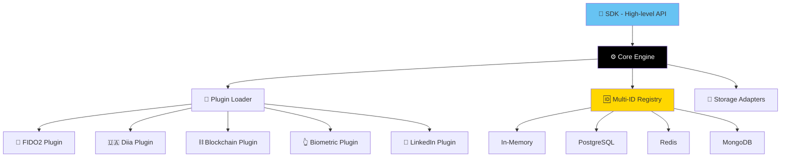

# iQ-auth 🔐

**AI-Powered Multi-Factor Authentication Framework | Not XMPP/Jabber**

[](https://github.com/010-io/iQ-auth/actions)
[](LICENSE)
[](https://pnpm.io/)
[](https://www.typescriptlang.org/)
[](https://stand-with-ukraine.pp.ua)

> **⚠️ IMPORTANT:** This is a **modern authentication framework** for AI/FIDO2/Blockchain/GovTech. **NOT related to legacy XMPP `jabber:iq:auth`** protocol. If you're looking for Jabber/Openfire/ejabberd XML authentication, this is not the project you need.

**Інноваційна модульна система авторизації з динамічним крипто-ланцюгом, AI-інтеграцією та мультифакторною ідентифікацією для сучасних веб/мобільних додатків.**

iQ-auth — це TypeScript/Node.js фреймворк нового покоління для побудови захищених, розширюваних систем автентифікації з підтримкою **FIDO2/WebAuthn**, **біометрії**, **blockchain-гаманців**, **державної цифрової ідентифікації (Diia.gov.ua)**, **соціальних мереж** та **локальних AI-асистентів** (Ollama/Llama).

**Built by:** [Igor Omelchenko (010io)](https://github.com/010-io) — AI/Mesh Architect, GovTech Developer

---

## ✨ Особливості

### 🔌 Модульна Архітектура
- **LEGO-принцип**: Core + розширювані плагіни
- **Монорепо**: pnpm workspaces з `@iq-auth/*` пакетами
- **Незалежність**: Кожен модуль публікується окремо

### 🆔 Multi-ID Registry
Підтримка множинних ідентичностей для користувача:
- 📱 Device ID
- 👆 Biometric ID
- 👤 Social ID (LinkedIn, GitHub)
- 💰 Wallet ID (MetaMask, Solana)
- 🏛️ Government ID (Diia.gov.ua)

### 🔐 Методи Автентифікації
- ✅ **FIDO2/WebAuthn** - сучасний стандарт без паролів
- 🔗 **Blockchain** - MetaMask, Solana, EVM-сумісні гаманці
- 🇺🇦 **Diia.gov.ua** - державна цифрова ідентифікація
- 👆 **Biometric** - відбитки пальців, Face ID
- 💼 **LinkedIn Verified** - професійна ідентифікація
- 🔑 **Password** - традиційний fallback

### 🤖 AI Integration
- **Ollama/Llama 3.1** - локальні LLM моделі (безкоштовно)
- **WINWIN AI** - українська мовна модель
- **Опціонально**: Gemini API, OpenAI
- **Плагінний підхід**: легко додати нові AI-провайдери

### 🔄 Auto-Versioning
- **CREATOR_SEED** + **VERSION_SEED** - унікальна система версійності
- Криптографічний ланцюг для захисту авторських прав
- Автоматична генерація CHANGELOG

### 💾 Гнучкість Storage
- In-memory (для розробки)
- PostgreSQL (адаптер)
- Redis (адаптер)
- MongoDB (адаптер)
- Власні адаптери через інтерфейси

---

## 🌐 Device & Protocol Support

iQ-auth підтримує **universal authentication** від бюджетних Bluetooth-навушників до enterprise Vertu phones та high-end Mac Pro.

### Supported Platforms

| Platform | Devices | Auth Methods | Security Features |
|----------|---------|-------------|-------------------|
| **Android** | Xiaomi, POCO, Samsung, Huawei, OnePlus, Pixel, Vertu | FIDO2, Biometric, OAuth2, Device Key, NFC | Keystore, SafetyNet, StrongBox, TrustZone |
| **iOS/macOS** | iPhone, iPad, MacBook, Mac Pro, iMac | Face/Touch ID, FIDO2, OAuth2, Device Key | Secure Enclave, App Attest, Sandboxing |
| **Windows** | Surface, PCs, Laptops, Tablets | Windows Hello, FIDO2, TPM, SmartCard | TPM 2.0, BitLocker, WebAuthn |
| **Linux** | Ubuntu, Debian, Custom hardware | FIDO2, U2F, SSH PKI | Kernel crypto, TPM, Open source |
| **IoT/Wearables** | Smart watches, BLE devices, Home IoT | BLE pairing, NFC, Device registry | Companion auth, Trusted devices |
| **Blockchain** | MetaMask, Ledger, Trezor, Solana wallets | WalletConnect, EIP-712, Seed phrases | Hardware wallets, Multi-chain |
| **Secure Phones** | Vertu, Bittium, Sirin, Blackphone | Hardware crypto, E2EE, Custom VPN | Secure Element, Post-quantum ready |

### Core Protocols

- ✅ **OAuth 2.0 / OpenID Connect** - Google, Apple, Microsoft, LinkedIn, Diia.gov.ua, Huawei
- 🚧 **FIDO2 / WebAuthn** - Passwordless, hardware-backed authentication
- 📋 **Biometric APIs** - Fingerprint, Face ID, Iris, Voice
- 📋 **Hardware Security** - TPM, Secure Enclave, TrustZone, StrongBox, Secure Element
- 📋 **Connectivity** - BLE, NFC, UWB, QR codes
- 📋 **Blockchain** - MetaMask, WalletConnect, Solana, EVM chains
- 📋 **Government ID** - Diia.gov.ua, ICAO Passport, eIDAS, SmartCard/PKI
- 📋 **Post-Quantum** - Kyber, Dilithium (roadmap)

**Legend:** ✅ Implemented | 🚧 In Progress | 📋 Planned

Детальна матриця підтримки: [DEVICE_SUPPORT.md](docs/DEVICE_SUPPORT.md)

---

## 🚀 Quick Start

### Встановлення

```bash
# Інсталяція SDK
pnpm add @iq-auth/sdk

# Або core для низькорівневого доступу
pnpm add @iq-auth/core

# Плагіни (опціонально)
pnpm add @iq-auth/plugin-fido2
pnpm add @iq-auth/plugin-blockchain
```

### Базове Використання

```typescript
import { IQAuthSDK } from '@iq-auth/sdk';
import { FIDO2Plugin } from '@iq-auth/plugin-fido2';

// Створення SDK інстансу
const auth = new IQAuthSDK();

// Реєстрація FIDO2 плагіна
const fido2 = new FIDO2Plugin();
await auth.engine.plugins.register(fido2);
await auth.engine.plugins.initialize('fido2', {
  rpName: 'My App',
  rpId: 'example.com',
  origin: 'https://example.com',
});

// Автентифікація користувача
const result = await auth.authenticate('fido2', {
  challenge: challengeFromServer,
  credential: userCredential,
});

if (result.success) {
  console.log('✅ Authenticated:', result.userId);
}

// Реєстрація ідентичності
await auth.registerIdentity({
  type: 'wallet',
  userId: 'user-123',
  provider: 'metamask',
  data: { address: '0x742d35Cc6634C0532925a3b844Bc9e7595f0bEb' },
  verified: true,
});

// Отримання всіх ідентичностей користувача
const identities = await auth.getUserIdentities('user-123');
console.log('User identities:', identities);
```

---

## 📦 Пакети

| Пакет | Опис | Версія |
|-------|------|--------|
| [`@iq-auth/core`](packages/core) | Ядро системи автентифікації |  |
| [`@iq-auth/sdk`](packages/sdk) | High-level SDK для розробників |  |
| [`@iq-auth/cli`](packages/cli) | CLI інструмент для DevOps |  |
| [`@iq-auth/ai`](packages/ai-assistant) | AI-асистент та інтеграції |  |
| **Плагіни** | | |
| [`@iq-auth/plugin-fido2`](packages/plugins/fido2) | FIDO2/WebAuthn | 🚧 |
| [`@iq-auth/plugin-diia`](packages/plugins/diia) | Diia.gov.ua | 🚧 |
| [`@iq-auth/plugin-blockchain`](packages/plugins/blockchain) | MetaMask, Solana, EVM | 🚧 |
| [`@iq-auth/plugin-biometric`](packages/plugins/biometric) | Біометрична автентифікація | 🚧 |
| [`@iq-auth/plugin-linkedin`](packages/plugins/linkedin) | LinkedIn OAuth | 🚧 |
| [`@iq-auth/plugin-wallet`](packages/plugins/wallet) | Multi-wallet підтримка | 🚧 |

---

## 🏗️ Архітектура



### Компоненти

1. **Core Engine** (`@iq-auth/core`)
   - Plugin Loader - динамічне завантаження плагінів
   - Identity Registry - управління множинними ідентичностями
   - Storage Adapters - інтерфейси для різних БД
   - Type System - TypeScript типізація

2. **SDK** (`@iq-auth/sdk`)
   - Зручний API для розробників
   - Обгортки над Core функціями
   - Підтримка Browser + Node.js

3. **Plugins**
   - Реалізація конкретних методів автентифікації
   - Ізольовані та незалежні
   - Легко додавати нові

---

## 🛠️ Development

### Prerequisites

- Node.js >= 18.0.0
- pnpm >= 8.0.0

### Клонування та Setup

```bash
git clone https://github.com/010-io/iQ-auth.git
cd iQ-auth

# Встановлення залежностей
pnpm install

# Збірка всіх пакетів
pnpm build

# Запуск тестів
pnpm test

# Lint
pnpm lint

# Type check
pnpm typecheck
```

### Структура Проекту

```
iQ-auth/
├── packages/              # Монорепо пакети
│   ├── core/             # Ядро системи
│   ├── sdk/              # SDK
│   ├── cli/              # CLI інструмент
│   ├── ai-assistant/     # AI інтеграція
│   └── plugins/          # Плагіни автентифікації
│       ├── fido2/
│       ├── diia/
│       ├── blockchain/
│       ├── biometric/
│       ├── linkedin/
│       └── wallet/
├── docs/                 # Документація (VitePress)
├── examples/             # Приклади використання
├── scripts/              # Automation скрипти
├── .github/workflows/    # CI/CD
└── test/                 # Інтеграційні тести
```

---

## 📚 Документація

- [🏠 Documentation Site](https://010io.github.io/iq-auth) (coming soon)
- [📖 API Reference](docs/api)
- [🔌 Plugin Development Guide](docs/plugins)
- [🤝 Contributing Guide](CONTRIBUTING.md)
- [🔒 Security Policy](SECURITY.md)

---

## 🧪 Testing

```bash
# Всі тести
pnpm test

# Watch mode
pnpm test:watch

# Coverage (>85% required)
pnpm test:coverage

# Інтеграційні тести
pnpm test:integration
```

---

## 🚢 Deployment

### Auto-Versioning

```bash
# Bump версії з CREATOR_SEED + VERSION_SEED
pnpm bump-version

# Перевірити зміни
git diff

# Commit та push
git add -A
git commit -m "chore: bump version"
git push --tags
```

### CI/CD

GitHub Actions автоматично:
- ✅ Запускає тести та lint
- 🏗️ Будує пакети
- 📦 Публікує на npm (релізи)
- 📝 Генерує CHANGELOG

---

## 🤝 Contributing

Вітаємо внески від спільноти! 🇺🇦

1. Fork репозиторій
2. Створіть feature branch (`git checkout -b feature/amazing`)
3. Commit зміни (`git commit -m 'feat: add amazing feature'`)
4. Push до branch (`git push origin feature/amazing`)
5. Відкрийте Pull Request

Детальніше в [CONTRIBUTING.md](CONTRIBUTING.md).

---

## 📄 License

[MIT](LICENSE) © 2025 [Igor Omelchenko (010io)](https://github.com/010-io)

---

## 🙏 Acknowledgments

- Diia.gov.ua - за натхнення та специфікації
- OpenMind Fabric - за mesh-архітектуру
- Спільнота Ukrainian GovTech - за підтримку

---

## 📞 Contact

- **Author:** Igor Omelchenko (010io)
- **GitHub:** [@010-io](https://github.com/010-io)
- **Organization:** Be Transparent

---

<div align="center">

**iQ-auth: національна ідентичність, максимальна відкритість та безпека** 🇺🇦

Made with ❤️ in Ukraine

**Слава Україні!**

</div>
